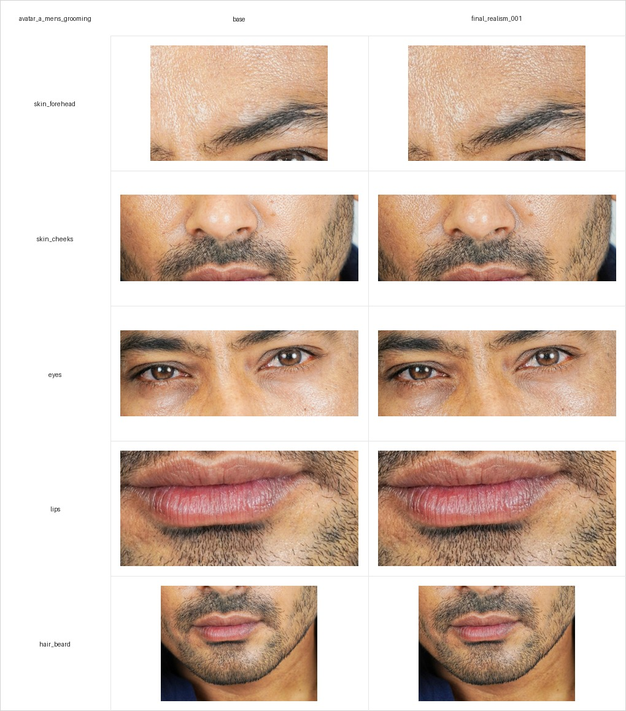
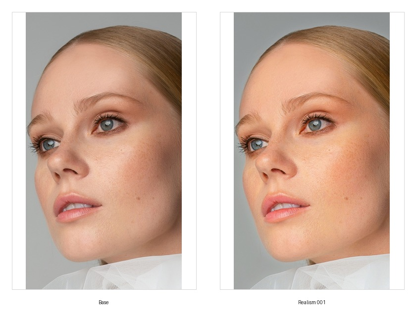

# AI UGC Avatar Realism Pipeline for Beauty & Grooming Brands

## 1. Цель

Проверить управляемый workflow улучшения реалистичности AI/UGC portrait still для men's grooming кейса: от source reference и base still до realism pass, crop-проверки, scoring и подготовки материалов для будущего image-to-video теста.

## 2. Почему этот кейс важен

Для UGC-style avatar content недостаточно получить визуально приятный portrait. Перед image-to-video важно отдельно проверить зоны, которые чаще всего ломают реализм:

- кожа;
- глаза;
- губы;
- волосы и борода;
- identity consistency.

Цель этого проекта — показать не только финальную картинку, но и контролируемый pipeline: source tracking, tool settings, crop comparison, scoring и limitations.

## 3. Целевая ниша

Первый рабочий трек:

- Avatar A: Men's Grooming Advisor
- Niche: men's grooming
- Use cases: face wash, beard care, moisturizer, shaving, fragrance/body care

Avatar B для skincare routine creator добавлен на уровне source/base, первого ON1 realism pass и user scoring.

## 4. Метод

Текущий pipeline:

1. Source reference из Pexels.
2. Base still в `03_base_avatars/`.
3. Realism pass через ON1 Photo RAW 2025.
4. Full image comparison grid.
5. Crop extraction по зонам лица.
6. Crop comparison grid.
7. User visual scoring по шкале 1-5.

Avatar A и Avatar B уже прошли шаги до user visual scoring.

## 5. Источник изображения

Source reference:

- File: `02_source_data/public_references/pexels_unsplash/mens_grooming_pexels_001.jpg`
- Source: Pexels
- Source URL: https://www.pexels.com/ru-ru/photo/11772165/
- License note: Pexels license checked on 2026-05-20.

Pexels позволяет бесплатное использование и модификацию фото; attribution is not required but appreciated. Важное ограничение: нельзя использовать человека на фото так, будто он endorses продукт или бренд.

## 6. Avatar A: Men's Grooming Advisor

Character files:

- `01_character_briefs/avatar_a_mens_grooming/character_brief.md`
- `01_character_briefs/avatar_a_mens_grooming/character_profile.json`
- `01_character_briefs/avatar_a_mens_grooming/prompt_history.md`

Base avatar:

- `03_base_avatars/avatar_a_mens_grooming/selected/base.jpg`

Realism output:

- `04_realism_passes/avatar_a_mens_grooming/final_stills/final_realism_001.jpg`

Tool:

- ON1 Photo RAW 2025
- Settings file: `09_workflows/on1/avatar_a_realism_001_on1_photo_raw_2025.onp`
- Readable settings summary: `09_workflows/on1/on1_realism_001_settings_summary.md`

Key readable ON1 settings include Brilliance AI - Люди, increased structure/clarity, mild vibrance/color/tone adjustments, reduced highlights/whites and small exposure/contrast corrections.

## 7. Avatar B: Skincare Routine Creator

Character files:

- `01_character_briefs/avatar_b_skincare_creator/character_brief.md`
- `01_character_briefs/avatar_b_skincare_creator/character_profile.json`
- `01_character_briefs/avatar_b_skincare_creator/prompt_history.md`

Source reference:

- File: `02_source_data/public_references/pexels_unsplash/skincare_creator_pexels_001.jpg`
- Source: Pexels
- Source URL: https://www.pexels.com/ru-ru/photo/4575002/
- License note: Pexels license checked on 2026-05-20.

Base avatar:

- `03_base_avatars/avatar_b_skincare_creator/selected/base.jpg`

Current status:

- source/base stage complete;
- realism pass 001 complete;
- crop analysis complete;
- scoring complete.

Realism output:

- `04_realism_passes/avatar_b_skincare_creator/final_stills/final_realism_001.jpg`

Tool:

- ON1 Photo RAW 2025
- Settings file: `09_workflows/on1/avatar_b_realism_001_on1_photo_raw_2025.onp`
- Readable settings summary: `09_workflows/on1/on1_avatar_b_realism_001_settings_summary.md`

Key readable ON1 settings include Brilliance AI - Люди, increased exposure, reduced dehaze, noise reduction, enabled auto tone/color and reduced highlights/whites.

## 8. Visual comparison

Full image comparison:

Crop comparison:

Avatar B full image comparison:

Avatar B crop comparison:

Crop zones:

- `skin_forehead`
- `skin_cheeks`
- `eyes`
- `lips`
- `hair_beard`

Crop manifests:

- `06_analysis/crops/avatar_a_mens_grooming/crop_manifest.csv`
- `06_analysis/crops/avatar_b_skincare_creator/crop_manifest.csv`

## 9. Scoring

### Avatar A

Scoring source: user visual review after crop correction.

| Metric | Score | Notes |
|---|---:|---|
| skin_realism | 4 | Кожа стала достаточно хорошей для case draft. |
| eye_realism | 3 | Глаза приемлемы, но не strongest improvement area. |
| lips_realism | 4 | Губы оценены как хорошие для case draft. |
| hair_beard_realism | 3 | Борода приемлема, но требует дальнейшего улучшения. |
| identity_consistency | 5 | Личность сохранена очень хорошо. |
| overall_score | 4 | Realism pass принят для черновика кейса. |

CSV log:

- `04_realism_passes/realism_run_log.csv`

Verdict:

`realism_001` принят как `accepted_for_case_draft`.

### Avatar B

Scoring source: user visual review after crop comparison.

| Metric | Score | Notes |
|---|---:|---|
| skin_realism | 4 | Кожа оценена как хорошая для case draft. |
| eye_realism | 5 | Глаза — самая сильная зона текущего pass. |
| lips_realism | 4 | Губы оценены как хорошие для case draft. |
| hair_beard_realism | 4 | Для Avatar B это hair/hairline зона, колонка оставлена общей для CSV. |
| identity_consistency | 4 | Личность сохранена хорошо. |
| overall_score | 4 | Realism pass принят для черновика кейса. |

CSV log:

- `04_realism_passes/realism_run_log.csv`

Verdict:

`avatar_b_realism_001` принят как `accepted_for_case_draft`.

## 10. Color / tone statistics

Stats file:

- `06_analysis/lab_color_stats/avatar_a_mens_grooming_color_stats.csv`
- `06_analysis/lab_color_stats/avatar_b_skincare_creator_color_stats.csv`

Краткое наблюдение: `final_realism_001` стал немного темнее во всех crop-зонах, при этом saturation немного выросла почти везде.

| Zone | Luminance delta | Saturation delta | Chroma proxy delta |
|---|---:|---:|---:|
| eyes | -0.0245 | +0.0136 | +0.0018 |
| hair_beard | -0.0088 | +0.0049 | +0.0001 |
| lips | -0.0137 | +0.0067 | -0.0026 |
| skin_cheeks | -0.0224 | +0.0124 | +0.0018 |
| skin_forehead | -0.0342 | +0.0175 | +0.0042 |

Ограничение: это RGB/HSV/luminance statistics, а не полноценный LAB analysis. Таблица показывает color/tone shift, но не заменяет visual scoring.

Для Avatar B `final_realism_001` стал светлее и насыщеннее во всех crop-зонах.

| Zone | Luminance delta | Saturation delta | Chroma proxy delta |
|---|---:|---:|---:|
| eyes | +0.0428 | +0.0421 | +0.0663 |
| hair_beard | +0.0315 | +0.0338 | +0.0513 |
| lips | +0.0284 | +0.0464 | +0.0644 |
| skin_cheeks | +0.0317 | +0.0479 | +0.0681 |
| skin_forehead | +0.0288 | +0.0493 | +0.0649 |

## 11. Что сработало

- Source image теперь отслеживается через `dataset_register.csv`.
- Pexels URL и license note добавлены.
- ON1 preset сохранен как workflow artifact.
- Crop extraction позволяет оценивать не только full image, но и отдельные зоны лица.
- Crop comparison grid удобна для scoring и будущего отчета.
- Identity consistency высокая: итоговый still сохраняет исходное лицо.
- Avatar B source/base trail создан.
- Avatar B ON1 realism pass, comparison grid, crop grid и color/tone stats созданы.

## 12. Что пока не сработало / ограничения

- Точный visual improvement не автоматизирован; scoring пока ручной.
- Eyes и hair/beard получили score `3`, значит эти зоны остаются кандидатами на следующий realism pass.
- Image-to-video outputs добавлены и получили user scoring.
- Для обоих аватаров есть realism scoring и video scoring.
- Нет полноценного LAB analysis; текущая таблица использует RGB/HSV/luminance statistics.
- Не нужно утверждать, что этот результат commercial-ready; текущий статус — case draft.

## 13. Video tests

Подготовлены входные файлы для короткого image-to-video теста:

| Video run | Avatar | Input still | Prompt | Status |
|---|---|---|---|---|
| avatar_a_video_001 | avatar_a_mens_grooming | `05_video_tests/avatar_a_mens_grooming/input_stills/avatar_a_realism_001_input.jpg` | `05_video_tests/avatar_a_mens_grooming/prompt_video_001.md` | accepted_for_case_draft |
| avatar_b_video_001 | avatar_b_skincare_creator | `05_video_tests/avatar_b_skincare_creator/input_stills/avatar_b_realism_001_input.jpg` | `05_video_tests/avatar_b_skincare_creator/prompt_video_001.md` | accepted_for_case_draft |

Output videos:

Technical metadata:

| Video run | Output file | Duration | Resolution | Codec |
|---|---|---:|---|---|
| avatar_a_video_001 | `05_video_tests/avatar_a_mens_grooming/video_outputs/avatar_a_video_001.mp4` | 5.04 sec | 1176x1764 | H.264 |
| avatar_b_video_001 | `05_video_tests/avatar_b_skincare_creator/video_outputs/avatar_b_video_001.mp4` | 5.04 sec | 1080x1920 | H.264 |

Video scoring:

| Video run | face_stability | eye_stability | lips_stability | skin_stability | identity_consistency | overall_score | Verdict |
|---|---:|---:|---:|---:|---:|---:|---|
| avatar_a_video_001 | 5 | 5 | 5 | 5 | 5 | 5 | accepted_for_case_draft |
| avatar_b_video_001 | 5 | 5 | 5 | 5 | 5 | 5 | accepted_for_case_draft |

Инструмент генерации: Magnific, модель Kling 3.0, `www.magnific.com`.

## 14. Следующие шаги

1. При необходимости сделать второй realism pass для Avatar A: focus on eyes and beard.
2. При необходимости сделать второй realism pass для Avatar B: focus on skin texture balance and identity consistency.
3. Выполнить финальную проверку публикации.

## 15. Текущий статус

Avatar A имеет полный минимальный case trail:

- source reference;
- base still;
- realism still;
- ON1 settings;
- full comparison;
- crop comparison;
- scoring;
- limitations.

Avatar B имеет source/base trail, ON1 realism pass, comparison/crop artifacts, color/tone stats и visual scoring.

Этого достаточно для расширенного черновика отчета. Для финальной публикации осталось выполнить финальную проверку публикации.
