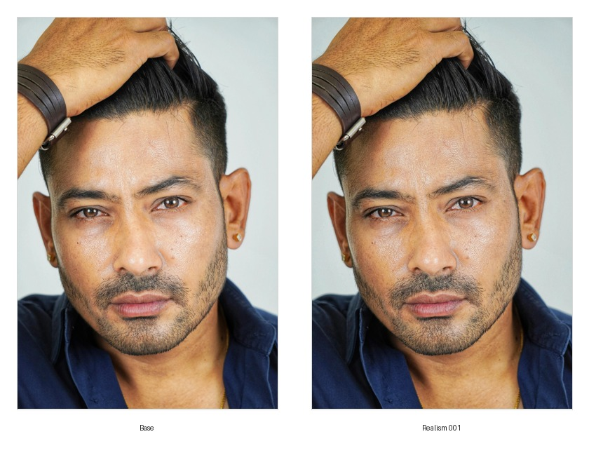
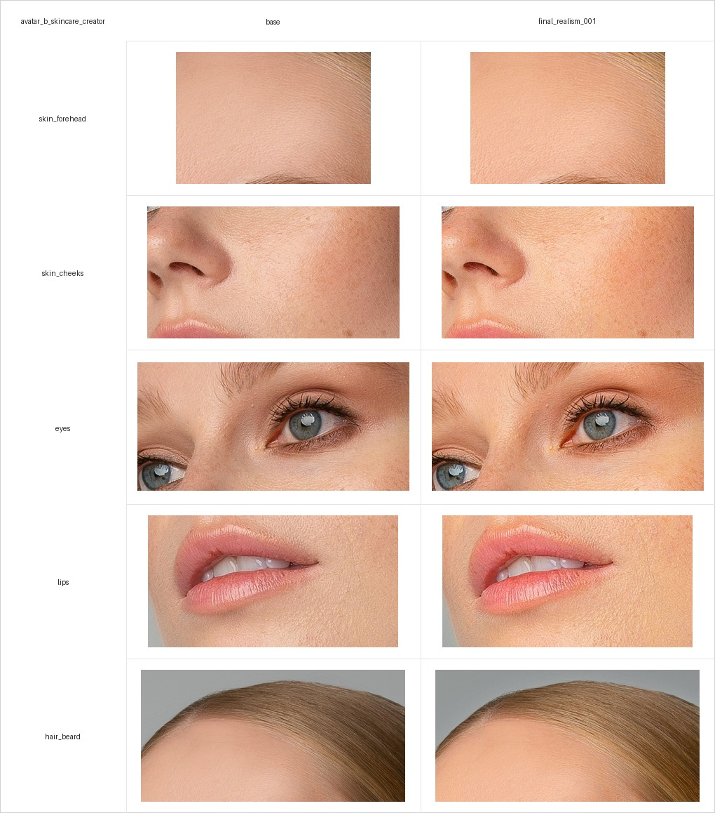

# AI UGC Avatar Realism Case

Portfolio case study for a traceable AI-avatar realism workflow in beauty, skincare, and men's grooming UGC scenarios.

The project shows how portrait stills can be prepared, improved, checked by facial zones, scored, and then tested as short image-to-video outputs.

## Live Case

- GitHub Pages: https://dun4ev.github.io/ai-ugc-avatar-realism-case/
- Repository: https://github.com/Dun4ev/ai-ugc-avatar-realism-case

## Preview

### Avatar A: men's grooming realism pass



### Avatar B: skincare creator crop comparison



## What This Case Demonstrates

- A structured source-to-report pipeline for AI/UGC avatar realism.
- Two public-reference avatars: men's grooming and skincare creator.
- ON1 Photo RAW 2025 realism passes with saved settings.
- Facial-zone crop analysis for skin, eyes, lips, hair/beard or hairline.
- Manual scoring instead of fabricated automated claims.
- Magnific / Kling 3.0 image-to-video tests.
- A static HTML case study suitable for portfolio use.

## Results

- Avatar A realism score: `4/5` overall.
- Avatar B realism score: `4/5` overall.
- Avatar A video score: `5/5` overall.
- Avatar B video score: `5/5` overall.

The current status is portfolio-grade case study, not a production avatar system.

## Project Structure

- `01_character_briefs/` - avatar profiles, prompts, and character notes.
- `02_source_data/` - public source references and dataset register.
- `03_base_avatars/` - selected base stills.
- `04_realism_passes/` - improved stills and realism scoring log.
- `05_video_tests/` - video input stills, prompts, outputs, and video scoring log.
- `06_analysis/` - crop analysis, comparison grids, and color/tone statistics.
- `07_report/` - Markdown and HTML report.
- `08_site/` - published static site used by GitHub Pages.
- `09_workflows/` - external tool notes and ON1 preset files.
- `scripts/` - small Python utilities for validation, crops, grids, stats, and site build.

## Local Setup

Create a virtual environment only when you need to run the scripts:

```bash
python3 -m venv .venv
source .venv/bin/activate
pip install --upgrade pip
pip install -r requirements.txt
```

Validate the project structure:

```bash
python3 scripts/validate_project_structure.py
```

Build the static report and site:

```bash
python3 scripts/build_html_report.py
```

Outputs:

- `07_report/report.html`
- `08_site/index.html`

## Useful Scripts

Register source images:

```bash
python3 scripts/register_dataset.py
```

Create a contact sheet:

```bash
python3 scripts/make_contact_sheet.py
```

Create a full-image comparison grid:

```bash
python3 scripts/make_comparison_grid.py \
  --avatar-id avatar_a_mens_grooming \
  --images path/to/base.jpg path/to/realism.jpg \
  --labels "Base" "Realism 001"
```

Extract face-zone crops:

```bash
python3 scripts/extract_face_crops.py \
  --avatar-id avatar_a_mens_grooming \
  --images \
    03_base_avatars/avatar_a_mens_grooming/selected/base.jpg \
    04_realism_passes/avatar_a_mens_grooming/final_stills/final_realism_001.jpg
```

Create a crop comparison grid:

```bash
python3 scripts/make_crop_comparison_grid.py \
  --avatar-id avatar_a_mens_grooming \
  --overwrite
```

Calculate simple color/tone statistics:

```bash
python3 scripts/lab_color_stats.py \
  --avatar-id avatar_a_mens_grooming
```

## Tools Used

- ON1 Photo RAW 2025 for still-image realism passes.
- Magnific with Kling 3.0 for image-to-video generation.
- Python, Pillow, NumPy, CSV logs, and static HTML/CSS for analysis and reporting.

## Limitations

- Visual scoring is manual and subjective.
- Color/tone stats are RGB/HSV/luminance-based, not full LAB analysis.
- The reference images are public Pexels images, not owned/private brand assets.
- The project should not imply that the people in the reference images endorse any product or brand.
- This is a case study and workflow prototype, not a commercial-ready production system.

## Publication Notes

The public report is in English. Some internal working notes may remain in Russian because they are not part of the portfolio-facing layer.
